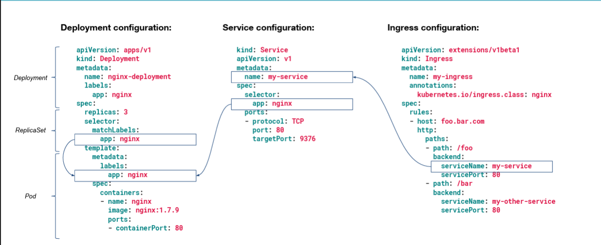
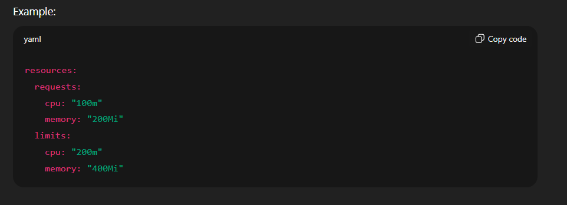
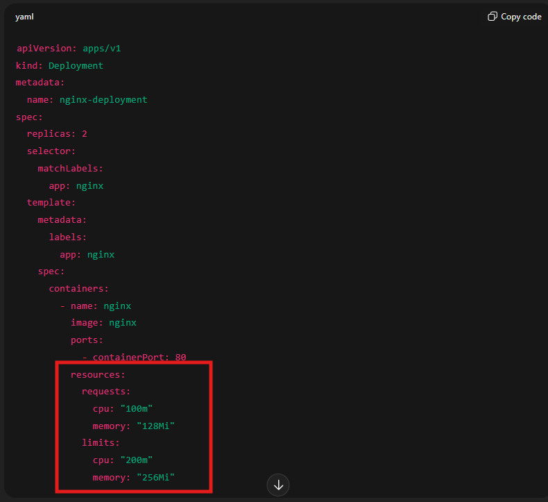

# Pod

A pod is nothing but the small unit of Kubernetes which can contain one or two containers.

**Process:**  
- We write the pod.yaml file and we mention all the information over there regarding the image which we want to run on the container, and the container runs inside the pod.

**Guide:**  
Follow this: [Guide to install Minikube on Windows + create your first pod](https://dev.to/nandkishor/guide-to-install-minikube-on-windows-to-practice-kubernetes-and-create-your-first-pod-14o8)

---

# Deployment

The primary reason to use a Deployment instead of creating a Pod directly is to leverage Kubernetes' built-in auto-healing and auto-scaling behaviors. Pods themselves do not have this capability.

## Key Concept:
- When you create a **Deployment** resource, it does not directly create the Pods. Instead, a Deployment resource first creates a **Replica Set**.
- The **Replica Set** is identified as a Kubernetes controller.
- This **Replica Set** is then responsible for creating the Pods.
- The role of the Replica Set created by the Deployment is to implement the auto-healing feature of your Pods and to ensure that the desired number of Pod replicas is always present on the cluster.

---

## How Auto-Healing and Auto-Scaling Work via Deployment and Replica Set

**Auto-healing:**
- If a Pod created by a Replica Set gets deleted (even accidentally or by a user) or fails for some reason, the Replica Set controller will notice that the actual number of running Pods is less than the desired number specified in the Deployment YAML file.
- Because the controller's job is to ensure the desired state matches the actual state.
- It will automatically create a new Pod to bring the count back to the desired number.

**Auto-scaling:**
- If you need to increase the number of Pod replicas (e.g., due to high load), you can simply modify the Deployment YAML file to increase the replica count.
- When you apply the updated configuration or YAML file, the Replica Set will detect the change in the desired state and automatically create the additional Pods required to reach the new replica count.  
  *This can be done without disturbing the existing running Pods.*

---

## Steps to Create a Deployment (Hands-On)

1. **Create the YAML file** that can store all the information of deployment like image, replicas, API version, containers etc.  
   *Example:* `DeployDemo.yaml`
2. Run the following command to create the deployment:  

```
kubectl apply -f DeployDemo.yaml
```

3. Check the status of deploy, pods, and replica sets; these all are created or not by running:  

```
kubectl get all
```

4. Run below command to check detailed info of pods:  

```
kubectl get pods -w
```

5. Use below command to delete the pod:  

```
kubectl delete pod <pod name>
```


---

## How Deployment, Service, and Ingress Are Interconnected


---

# 🌱 What is HPA (Horizontal Pod Autoscaler)?

HPA automatically adjusts the **number of pods** in a Deployment / ReplicaSet / StatefulSet based on CPU, memory, or custom metrics.

**For example:**
- You have 3 replicas of a web app.
- If CPU usage goes above 80%, HPA will scale it to 6 pods.
- When CPU drops, it scales back down to 3.

---

## ⚙️ Prerequisites

- **Metrics Server** installed in your cluster (it collects pod resource metrics)
- Pods/Deployment should have **CPU resource requests and limits** set—otherwise HPA won’t know what to measure.


---

## 🧩 Create a Deployment (Example)

Here is a simple deployment.yaml example:




---

## ⚡ Create HPA (via Command)

You can create an HPA object directly from kubectl without YAML:

```
kubectl autoscale deployment nginx-deployment --cpu-percent=50 --min=2 --max=6
```


**This means:**
- If average CPU usage across pods > 50% of requested CPU, HPA increases replicas up to 6
- If CPU drops, scales back to a minimum of 2

---

## 🧠 Check HPA Status

```
kubectl get hpa
```

**Output:**
```
NAME REFERENCE TARGETS MINPODS MAXPODS REPLICAS AGE
nginx-deployment Deployment/nginx-deployment 30%/50% 2 6 2 3m
```


---

## 🧩 View Details (YAML or Describe)

```
kubectl describe hpa nginx-deployment
```

**You’ll see:**
- Current CPU usage
- Desired replicas
- Last scale event

---

## 🔁 How HPA Works Internally (Behind the Scenes)

1. The Metrics Server provides real-time resource metrics (CPU, memory).
2. The HPA Controller (built into the Kubernetes control plane)
   - Watches these metrics.
   - Calculates desired replicas.
   - It then updates the Deployment’s `.spec.replicas` field dynamically.
   - That triggers a new ReplicaSet scaling event (K8s does this automatically).

**Example:**
- Deployment’s `.spec.replicas = 2`
- HPA calculates desired replicas = 4
- Internally runs:

```
kubectl scale deployment nginx-deployment --replicas=4
```


Yes, HPA directly changes the ReplicaSet count associated with that Deployment.

---

## Commands and Workflow Overview

| Step                  | Command / Action                        | Purpose                       |
|-----------------------|-----------------------------------------|-------------------------------|
| Install metrics server| kubectl apply -f ...                    | Enables metric collection     |
| Create Deployment     | kubectl apply -f deployment.yaml        | Base workload                 |
| Create HPA            | kubectl autoscale deployment ...        | Autoscaler object             |
| Check status          | kubectl get hpa                         | View CPU usage & replicas     |
| View details          | kubectl describe hpa                    | Scaling decisions             |
| Delete HPA            | kubectl delete hpa <name>               | Disable autoscaling           |

---

## VPA (Vertical Pod Autoscaler)

VPA helps ensure every pod has the resources it needs for stable and efficient operation by adapting resource allocations dynamically as workload evolves.
