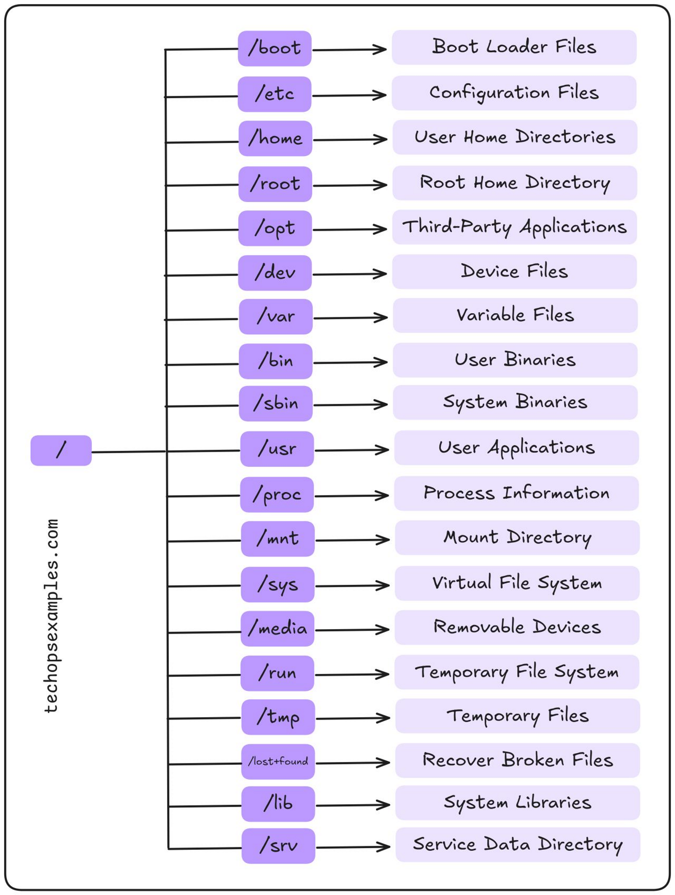
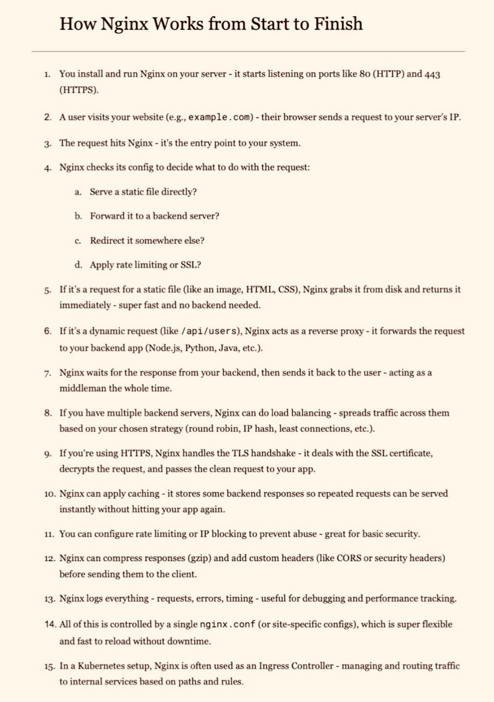

# Linux & Shell Scripting – README.md

## 1. What is an Operating System?
An **Operating System (OS)** is system software that manages computer hardware, software resources, and provides services for applications. It acts as a bridge between users and the underlying hardware.

---

## 2. What is Linux?
**Linux** is a free, open-source, fast, and secure operating system widely used in DevOps and enterprise environments. It has multiple distributions (Ubuntu, CentOS, Debian, RHEL, etc.).

---

## 3. Linux Architecture Components
### **1. Kernel (Core of OS)**
Manages hardware resources like CPU, memory, storage, and devices.

### **2. System Libraries**
Provides essential functions that allow applications to interact with the kernel.

### **3. Compilers**
Converts high-level code into machine instructions.

### **4. User Programs**
Applications such as browsers, text editors, or utilities.

### **5. System Software**
OS tools, utilities, and drivers.

### Summary Table
| Component | Function |
|----------|----------|
| Kernel | Manages hardware resources and system operations |
| System Libraries | Provides essential functions for applications |
| Compilers | Converts high‑level code into machine code |
| User Programs | Applications for users |
| System Software | Utilities, drivers, and OS services |

---

## 4. What is Shell Scripting?
A **shell script** is a file containing commands written in a shell language (like bash) to automate tasks.

### Examples:
- `man ls` → Displays manual for `ls`
- `history` → Shows list of recently used commands
- `wsl` → Runs Linux on Windows terminal

---

## 5. Basic & Daily Use Linux Commands

### **Directory & File Navigation**
| Command | Description | Example |
|---------|-------------|---------|
| pwd | Show current directory | pwd |
| ls | List files | ls |
| ls -l | Long listing | ls -l |
| ls -ltr | Sorted by time (oldest first) | ls -ltr |
| ls -a | Show hidden files | ls -a |
| cd \<dir> | Change directory | cd /home/user |
| cd .. | Move up one level | cd .. |
| mkdir \<dir> | Create directory | mkdir my_folder |
| rmdir \<dir> | Remove empty directory | rmdir my_folder |
| rm -r \<dir> | Delete directory with files | rm -r my_folder |
| cp \<src> \<dest> | Copy file | cp file.txt backup/ |
| mv \<src> \<dest> | Move/rename file | mv file1.txt newfile.txt |
| find / -name file.txt | Search file | find /home -name "*.log" |
| touch \<file> | Create file | touch file.txt |

---

## 6. File Viewing & Editing
| Command | Description | Example |
|---------|-------------|---------|
| cat | Display file | cat file.txt |
| tac | Reverse display | tac file.txt |
| less | Scroll through file | less file.txt |
| head -n | First n lines | head -5 file.txt |
| tail -n | Last n lines | tail -10 file.txt |
| tail -f | Live file updates | tail -f /var/log/syslog |
| nano | Open in nano | nano file.txt |
| vim | Open in vim | vim file.txt |

---

## 7. Searching & Filtering Commands
| Command | Description | Example |
|---------|-------------|---------|
| grep "text" file | Search text | grep "error" logs.txt |
| grep -i | Case‑insensitive | grep -i warning logs.txt |
| grep -r | Recursive search | grep -r failed /var/log |
| awk '{print $1}' file | Print column | awk '{print $2}' data.txt |
| sed 's/old/new/g' file | Replace text | sed 's/error/fixed/g' logs.txt |
| sort | Sort file | sort names.txt |
| uniq | Remove duplicates | uniq data.txt |

---

## 8. Process & System Monitoring
| Command | Description |
|---------|-------------|
| ps aux | Show all processes |
| top | Live CPU & memory usage |
| htop | Enhanced viewer |
| kill \<PID> | Kill process |
| kill -9 \<PID> | Force kill |
| pkill name | Kill by name |
| free -m | RAM usage |
| df -h | Disk usage |
| du -sh dir | Folder size |

---

## 9. Networking Commands
| Command | Description |
|---------|-------------|
| ip a | Show IP addresses |
| hostname -I | Show system IP |
| ping host | Test connectivity |
| curl URL | Fetch webpage |
| wget URL | Download file |
| netstat -tulnp | Show listening ports |

---

## 10. User & Permission Management
| Command | Description |
|---------|-------------|
| whoami | Current user |
| id | UID, GID info |
| sudo | Run as root |
| chmod 755 file | Set permissions |
| chown user:group file | Change ownership |

---

## 11. Scheduling & Automation
| Command | Description |
|---------|-------------|
| crontab -e | Edit cron jobs |
| crontab -l | List cron jobs |
| at 14:30 | Schedule once |
| sleep 10 | Pause execution |

---

## 12. Important Shortcuts
| Shortcut | Description |
|----------|-------------|
| Ctrl + C | Kill running command |
| Ctrl + Z | Pause process |
| Ctrl + D | Close terminal |
| Ctrl + L | Clear screen |
| !! | Repeat last command |
| !xyz | Run last command starting with xyz |

---

## 13. Shell Script Execution Rules
1. Create a file ending with `.bash` or `.sh`
2. Give execute permission → `chmod 777 file.sh`
3. Execute using:
```
./file.sh
```
4. `|` (pipe) passes command output to another command.

---

## 14. Linux Permission System
Each file has permissions for:
- **Owner**
- **Group**
- **Others**

### Permission Values
| Number | Permission | Meaning |
|--------|------------|---------|
| 0 | --- | No permission |
| 1 | --x | Execute |
| 2 | -w- | Write |
| 3 | -wx | Write + Execute |
| 4 | r-- | Read |
| 5 | r-x | Read + Execute |
| 6 | rw- | Read + Write |
| 7 | rwx | Full access |

---

## 15. Linux File System Hierarchy

---

## 16. NGINX
Placeholder heading (add details later based on requirement).


